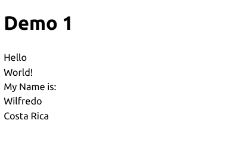

# Tutorial basico de PyScript


1. ["PyScript Pagina"](https://pyscript.net/)
2. ["PyScript Documentación"](https://docs.pyscript.net/2024.7.1/beginning-pyscript/)
3. ["PyScript Ejemplos Documentación"](https://pyscript.com/@examples)
4. ["PyScript Ejemplos proyectos"](https://docs.pyscript.net/2024.7.1/examples/)
5. ["PyScript comunidad"](https://discord.com/invite/HxvBtukrg2)
6. ["PyScript Guía de usuario"](https://docs.pyscript.net/2024.7.1/user-guide/)


### Servir los archivos con un servidor HTTP
```
  python3 -m http.server
```


## PyScript 2022.12.1

### Demo 1 - Insertar contenido

- ["Video tutorial"](https://www.youtube.com/live/AcFSzDBNjkI?si=D7zMcmHQUlpwmYyh)
- ["Guia del tutorial"](https://jeff.glass/post/whats-new-pyscript-2022-12-1/)

- Template html
```
<!DOCTYPE html>
<html>
  <head>
      <meta charset="utf-8" />
      <meta name="viewport" content="width=device-width,initial-scale=1" />
      <title>PyScript Demo 1</title>

      <link rel="stylesheet" href="https://pyscript.net/releases/2022.12.1/pyscript.css">
      <script type="module" src="https://pyscript.net/releases/2022.12.1/pyscript.js"></script>
  </head>
  <body>
        <h1>Demo 1</h1>

        <py-config>
        </py-config>

        <py-script>
        </py-script>
    
  </body>
</html>

```

- Insertar texto en html

```
    <py-script>
        display("Hello")
        display("World")
    </py-script>
    
```

- Insertar texto en html en un elemento
```
    <div id="output"></div>
    <div id="output-2">My Name is: </div>
    <div id="output-3">Country</div>

    <py-config>
    </py-config>

    <py-script>
        display("Hello", target="output")
        display("World!", append=True, target="output")
        display("Wilfredo", append=True, target="output-2")
        display("Costa Rica", append=False, target="output-3")
    </py-script>
```

- `target`: 
indica el id del elemento objetivo
- `append`: 
valor booleano, si su valor es true se agrega al contenido existen, si el valor es false reemplaza el contenido existente



### Demo 2 - py-terminal

- utilizar py-terminal
```
        <h1>Demo 2 - py-terminal</h1>

        <py-config>
        </py-config>

        <py-script>
          print("Hello world!")
          print("My name is Wilfredo.")
        </py-script>
```
`display()` es para escribir en la pantalla, y  `print()` escribe al `<py-terminal>`. 


```
    <py-config>
        terminal = false
    </py-config>
```
Por defecto py-terminal se muestra en pantalla si hay un `print()`, pero es posible configurarlo para que
se muestre en consola.


### Demo 3 - Leer archivos

Esta acción se realiza en la etiqueta `py-config`


- Importar un archivo y leer desde el otro directorio

```
    <py-config>
        [[fetch]]
        files = ['texto.txt']
        from = 'file/'
    </py-config>

    <py-script>
        text = 'Content: '
        with open('texto.txt', 'r') as fp:
            #print(fp.read())
            for line in fp:
                text += f"{line}"
        
        
        display(HTML(f"<p>{text}</p>"))
    </py-script>
```

- Importar un archivo y leer desde el mismo directorio

```
    <py-config>
        [[fetch]]
        files = ['texto2.txt']  
    </py-config>

    <py-script>
        text2 = ''
        with open('texto2.txt', 'r') as fp:
            #print(fp.read())
            for line in fp:
                text2 += f"{line}"
        
        
        display(HTML(f"<p>{text2}</p>"))
    </py-script>
```

`HTML` esta funcion permite insertar etiquetas html junto con su contenido

### Demo 4 - Importar archivos.py con funciones

```
<p id="date"></p>

<py-config>

    [[fetch]]
    files = ['demo4.py'] 
    from ="package"                                                                                                          
</py-config>

<py-script>

    from demo4 import demo4, hello_world, date, show_params,console_message

    print(demo4())

    hello_world()

    date()

    show_params("<h2>Tutorial</h2>")

    console_message("Pura vida!")

</py-script>
```

## PyScript 2024.7.1
Todas las aplicaciones de PyScript en esta version necesitan tres cosas:
1. Un `index.html` archivo que se muestra en el navegador.
2. Una descripción del entorno de Python en el que se ejecutará su aplicación. 
Esto generalmente se especifica por en un archivo llamado `pyscript.json` o `pyscript.toml`.
3. Código Python, generalmente en un archivo llamado algo así como `main.py`, en este se define cómo funciona su aplicación.

- `pyscript.json` 
El archivo `pyscript.json` se utiliza para configurar aspectos de tu aplicación PyScript y para especificar qué paquetes y dependencias necesita para funcionar correctamente. Este archivo es especialmente útil para incluir bibliotecas de terceros que no están incluidas por defecto en PyScript. También puede incluir otras configuraciones como variables de entorno, scripts de inicialización, etc.

- `pyscript.toml` 
El archivo `pyscript.toml` puede especificar dependencias de paquetes, configuración del entorno y otros aspectos de la aplicación. La diferencia principal radica en el formato de archivo; pyscript.toml utiliza el formato TOML (Tom's Obvious, Minimal Language), que es más legible y estructurado para los humanos, especialmente para configuraciones más complejas.

### Demo 5 - Ejemplo de documentación

En esta version hay muchos cambios considerables

- Cambio de tag para configurar y acceder a archivos
```
   <script type="py" src="./latest/main.py" config="./latest/pyscript.json"></script>
```
Se crea un archivo `main.py` donde escribiremos el codigo en python y otro archivo que contiene la configuracion `pyscript.json`

- Se incorpora mas al html agregando atributos nuevos
    - `py-click`: es un atributo utilizado en PyScript para asociar eventos de clic de botones u otros elementos HTML con funciones de Python.
    - `config`:  es un atributo utilizado para especificar la ruta a un archivo de configuración que define las dependencias y otras configuraciones necesarias para ejecutar el script de Python. 
    - `src`: este atributo especifica la ruta al archivo de Python (main.py) que se ejecutará.
    - `type="py"`: en este atributo con el valor `py` indica que el contenido del script es un script de Python que debe ser manejado por PyScript.

- index.html
```
    <h1>Polyglot 🦜 💬 🇬🇧 ➡️ 🏴‍☠️</h1>
    <p>Translate English into Pirate speak...</p>
    <input type="text" name="english" id="english" placeholder="Type English here..." />
    <button py-click="translate_english">Translate</button>
    <div id="output"></div>
    <script type="py" src="./latest/main.py" config="./latest/pyscript.json"></script>
```

- main.py
```
import arrr
from pyscript import document, display
from js import console

def translate_english(event):
    input_text = document.querySelector("#english")
    english = input_text.value
    output_div = document.querySelector("#output")
    output_div.innerText = arrr.translate(english)
    console.log(arrr.translate(english))

```

- pyscript.json
```
{
    "packages": ["arrr"]
}

```

### Demo 6 - Ejemplo de documentación Altair Gráficos Estadísticos


- index.html
```
<section class="pyscript">
    <div id="altair"></div>
    <script type="py" src="./altair/main.py" config="./altair/pyscript.toml"></script>
</section>
```

- pyscript.toml
```
name = "Altair"
description = "An application that uses vega datasets and Vega to plot heatmap and bar graphs."
packages = ["altair", "pandas", "vega_datasets"]


```

- main.py
```
from pyscript import display
import altair as alt
from vega_datasets import data

source = data.movies.url

pts = alt.selection_point(encodings=['x'])

rect = alt.Chart(data.movies.url).mark_rect().encode(
    alt.X('IMDB_Rating:Q', bin=True),
    alt.Y('Rotten_Tomatoes_Rating:Q', bin=True),
    alt.Color('count()',
        scale=alt.Scale(scheme='greenblue'),
        legend=alt.Legend(title='Total Records')
    )
)

circ = rect.mark_point().encode(
    alt.ColorValue('grey'),
    alt.Size('count()',
        legend=alt.Legend(title='Records in Selection')
    )
).transform_filter(
    pts
)

bar = alt.Chart(source).mark_bar().encode(
    x='Major_Genre:N',
    y='count()',
    color=alt.condition(pts, alt.ColorValue("steelblue"), alt.ColorValue("grey"))
).properties(
    width=550,
    height=200
).add_params(pts)

display(alt.vconcat(rect + circ, bar).resolve_legend(color="independent", size="independent"), target="altair")

```
### Demo 7 - Juego tic tac toc

- index.html
```
    <section class="pyscript">
        <h1>Tic-Tac-Toe</h1>

        <script type="py" src="./tic-tac-toe/main.py" config="./tic-tac-toe/pyscript.toml"></script>

        <table id="board">
            <tr>
                <td><div id="cell00" data-x="0" data-y="0" class="cell" py-click="GAME.click"></div></td>
                <td><div id="cell01" data-x="0" data-y="1" class="cell" py-click="GAME.click"></div></td>
                <td><div id="cell02" data-x="0" data-y="2" class="cell" py-click="GAME.click"></div></td>
            <tr>
                <td><div id="cell10" data-x="1" data-y="0" class="cell" py-click="GAME.click"></div></td>
                <td><div id="cell11" data-x="1" data-y="1" class="cell" py-click="GAME.click"></div></td>
                <td><div id="cell12" data-x="1" data-y="2" class="cell" py-click="GAME.click"></div></td>
            </tr>
            <tr>
                <td><div id="cell20" data-x="2" data-y="0" class="cell" py-click="GAME.click"></div></td>
                <td><div id="cell21" data-x="2" data-y="1" class="cell" py-click="GAME.click"></div></td>
                <td><div id="cell22" data-x="2" data-y="2" class="cell" py-click="GAME.click"></div></td>
            </tr>
        </table>

        <h2 id="status"></h2>
        <button id="btn-new-game" py-click="GAME.new_game">New game</button>
        <button id="btn-toggle-terminal" py-click="GAME.toggle_terminal">Hide/show terminal</button>

        <div id="terminal" hidden="hidden">
            <script id="console" type="py" terminal></script>
        </div>

    </section>
```

- main.py
```
from pyweb import pydom

class TicTacToe:
    def __init__(self):
        self.board = pydom["table#board"]
        self.status = pydom["h2#status"]
        self.console = pydom["script#console"][0]
        self.init_cells()
        self.init_winning_combos()
        self.new_game(...)

    def set_status(self, text):
        self.status.html = text

    def init_cells(self):
        self.cells = []
        for i in (0, 1, 2):
            row = []
            for j in (0, 1, 2):
                cell = pydom[f"div#cell{i}{j}"][0]
                assert cell
                row.append(cell)
            self.cells.append(row)

    def init_winning_combos(self):
        self.winning_combos = []
        # winning columns
        for i in (0, 1, 2):
            combo = []
            for j in (0, 1, 2):
                combo.append((i, j))
            self.winning_combos.append(combo)

        # winning rows
        for j in (0, 1, 2):
            combo = []
            for i in (0, 1, 2):
                combo.append((i, j))
            self.winning_combos.append(combo)

        # winning diagonals
        self.winning_combos.append([(0, 0), (1, 1), (2, 2)])
        self.winning_combos.append([(0, 2), (1, 1), (2, 0)])

    def new_game(self, event):
        self.clear_terminal()
        print('=================')
        print('NEW GAME STARTING')
        print()
        for i in (0, 1, 2):
            for j in (0, 1, 2):
                self.set_cell(i, j, "")

        self.current_player = "x"
        self.set_status(f'{self.current_player} playing...')

    def next_turn(self):
        winner = self.check_winner()
        if winner == "tie":
            self.set_status("It's a tie!")
            self.current_player = "" # i.e., game ended
            return
        elif winner is not None:
            self.set_status(f'{winner} wins')
            self.current_player = "" # i.e., game ended
            return

        if self.current_player == "x":
            self.current_player = "o"
        else:
            self.current_player = "x"
        self.set_status(f'{self.current_player} playing...')

    def check_winner(self):
        """
        Check whether the game as any winner.

        Return "x", "o", "tie" or None. None means that the game is still playing.
        """
        # check whether we have a winner
        for combo in self.winning_combos:
            winner = self.get_winner(combo)
            if winner:
                # highlight the winning cells
                for i, j in combo:
                    self.cells[i][j].add_class("win")
                return winner

        # check whether it's a tie
        for i in (0, 1, 2):
            for j in (0, 1, 2):
                if self.get_cell(i, j) == "":
                    # there is at least an empty cell, it's not a tie
                    return None # game still playing
        return "tie"

    def get_winner(self, combo):
        """
        If all the cells at the given points have the same value, return it.
        Else return "".

        Each point is a tuple of (i, j) coordinates.
        Example:
            self.get_winner([(0, 0), (1, 1), (2, 2)])
        """
        assert len(combo) == 3
        values = [self.get_cell(i, j) for i, j in combo]
        if values[0] == values[1] == values[2] and values[0] != "":
            return values[0]
        return ""

    def set_cell(self, i, j, value):
        assert value in ("", "x", "o")
        cell = self.cells[i][j]
        cell.html = value
        if "x" in cell.classes:
            cell.remove_class("x")
        if "o" in cell.classes:
            cell.remove_class("o")
        if "win" in cell.classes:
            cell.remove_class("win")
        if value != "":
            cell.add_class(value)

    def get_cell(self, i, j):
        cell = self.cells[i][j]
        value = cell.html
        assert value in ("", "x", "o")
        return value

    def click(self, event):
        i = int(event.target.getAttribute('data-x'))
        j = int(event.target.getAttribute('data-y'))
        print(f'Cell {i}, {j} clicked: ', end='')
        if self.current_player == "":
            print('game ended, nothing to do')
            return
        #
        value = self.get_cell(i, j)
        if value == "":
            print('cell empty, setting it')
            self.set_cell(i, j, self.current_player)
            self.next_turn()
        else:
            print(f'cell already full, cannot set it')

    def clear_terminal(self):
        self.console._js.terminal.clear()
    
    def toggle_terminal(self, event):
        hidden = self.console.parent._js.getAttribute("hidden")
        if hidden:
            self.console.parent._js.removeAttribute("hidden")
        else:
            self.console.parent._js.setAttribute("hidden", "hidden")

GAME = TicTacToe()

```

- script.js
```
const loading = document.getElementById('loading');
addEventListener('py:ready', () => loading.close());
loading.showModal();
```

- pyscript.toml
```
name = "Tic Tac Toe"
description = "A Tic-Tac-Toe game written in PyScript that allows to people take turns."

```

- style.css
```
body {
  margin: 0;
}

.pyscript {
  margin: 0.5rem;
}

h1, h2 {
  font-family: 'Indie Flower', 'Comic Sans', cursive;
  text-align: center;
}

#board {
  font-family: 'Indie Flower', 'Comic Sans', cursive;
  position: relative;
  font-size: 120px;
  margin: 1% auto;
  border-collapse: collapse;
}
#board td {
  border: 4px solid rgb(60, 60, 60);
  width: 90px;
  height: 90px;
  vertical-align: middle;
  text-align: center;
  cursor: pointer;
}

#board td div {
  width: 90px;
  height: 90px;
  line-height: 90px;
  display: block;
  overflow: hidden;
  cursor: pointer;
}

.x {
  color: darksalmon;
  position: relative;
  font-size: 1.2em;
  cursor: default;
}
.o {
  color: aquamarine;
  position: relative;
  font-size: 1.0em;
  cursor: default;
}

.win {
  background-color: beige;
}

#loading {
  outline: none;
  border: none;
  background: transparent;
}
```